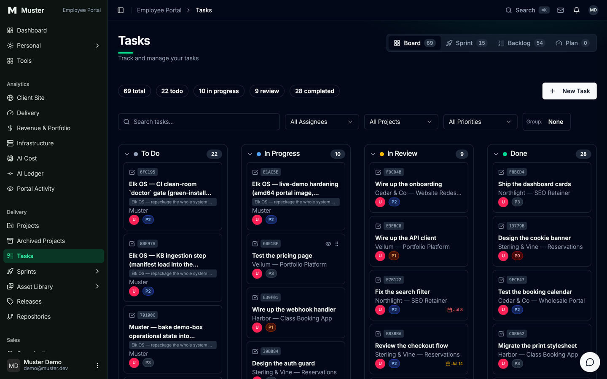

<h1 align="center">Muster</h1>

<p align="center">
  <strong>The operating system for agentic software teams.</strong><br>
  Stands up in one command; proves itself in one more.
  A human and a fleet of AI coding agents share one task board. Muster packages the
  whole loop (the task substrate, a production portal, and a local intelligence engine)
  so you can stand it up on a fresh cloud box or a laptop.
</p>

<p align="center">
  <a href="https://musterr.dev">Landing &amp; whitepaper</a> ·
  <a href="https://app.musterr.dev">Live portal demo</a> ·
  <a href="https://github.com/AnalogElk/muster">Source</a><br>
  <sub>Read-only demo login: <code>demo@muster.dev</code> / <code>muster-demo</code>.
  Live now on real Let's Encrypt TLS. (musterr.dev has two Rs on purpose.)</sub>
</p>

<p align="center">
  <a href="https://github.com/AnalogElk/muster/releases"></a>
  <a href="./LICENSE"></a>
  <a href="https://app.musterr.dev"></a>
</p>

> **Naming note:** the public product name is **Muster**; **Elk OS** is the
> project's working name and survives in the CLI (`bin/elk-os`), env vars
> (`ELK_OS_*`), and some internal docs. Renaming those is a tracked decision,
> not an accident. The two names refer to the same thing.

---

Most "AI for work" tools bolt a chatbot onto the side of your real system. Muster
inverts that. The **shared task board is the substrate**, and both the human and
the agents are first-class users of it. The row a human drags on a board is the
row an agent picks up over MCP and writes back when it's done. The intelligence
layered on top is local, private, and permission-aware. Muster ships that whole
loop, wired and reproducible, as a self-hostable product.

It is built solo over about six months as a thesis and portfolio project: a real,
running, multi-service system with a live public demo, not a slide deck. See
[who built this](#who-built-this) at the bottom.

```bash
git clone https://github.com/AnalogElk/muster.git && cd muster
./bin/elk-os init --profile generic         # generate secrets + .env
./bin/elk-os up                             # docker compose up the whole stack
./bin/elk-os migrate && ./bin/elk-os seed   # os_* schema + profile data
./bin/elk-os wire                           # point Claude Code at this board
./bin/elk-os doctor                         # green/red health board, the loop proof
```

<p align="center">
  <a href="https://app.musterr.dev"></a><br>
  <sub>The board is the product. This is the live portal at <a href="https://app.musterr.dev">app.musterr.dev</a>; the demo login is read-only.</sub>
</p>

Docker is the only hard dependency (`migrate`/`seed` additionally use stdlib
`python3`, see the CLI table below; building the portal image locally also
needs `git`/`node`/`perl` on the host, and `prepare-context.sh` preflights
them with the alternatives spelled out). Secrets are generated into a
gitignored `.env` and never printed.

> **Fresh-clone note:** the portal image builds from a *local checkout* of
> `analog-elk-front-end` (see [`portal/`](./portal/)), which a fresh clone
> won't have. `up` stops with the alternatives spelled out. Either set
> `ELK_OS_WITH_PORTAL=false` in `.env` (Directus + RAG + the board still stand
> up) or pull published images (`ELK_OS_USE_PUBLISHED_IMAGES=true` +
> `PORTAL_IMAGE`/`RAG_IMAGE`).

## The four subsystems

One `elk-os up` stands up four wired pieces:

| Subsystem | What it is |
|---|---|
| **Claude-side OS** | A governance constitution (`CLAUDE.md`), an MCP bridge, SessionStart hooks, and persistent memory that turn Claude Code into a standing team member. Rendered per-deployment by `elk-os wire`. |
| **Directus + `os_*`** | The shared-state bus: tasks, sprints, projects, releases, repositories. Directus's **native MCP server** (`/mcp`) is the agent's door to the board. |
| **The intelligent layer** | A local RAG engine (Postgres + Qdrant + Redis + FastAPI) plus **Elk Chat**, an in-portal assistant that answers over your own knowledge base and task data. Embeddings are local: no external inference, no API key, no quota. See [The intelligent layer](#the-intelligent-layer). |
| **The portal** | The human surface (admin + client), a Next.js app over the same `os_*` data. |

## The loop, concretely

```
        ┌─────────────────────────────────────────────────────┐
        │            Directus  +  the os_* board              │
        │     (tasks · sprints · projects · releases)         │
        └───────────────▲───────────────────────▲─────────────┘
       drags a card on  │                       │  reads/writes via the
        the portal      │                       │  native Directus MCP (/mcp)
                  ┌──────┴──────┐         ┌──────┴───────────┐
                  │    Human    │         │  Claude fleet    │
                  │  (portal)   │         │ (wired CLAUDE.md)│
                  └─────────────┘         └──────────────────┘
```

`elk-os wire` enables the native MCP server (`settings.mcp_enabled`), writes a
`.mcp.json` pointing Claude at *this* deployment's Directus, and proves the loop
by reading seeded `os_tasks` back through the same endpoint + token. `doctor`
then walks every subsystem, including a live `tools/list` probe against `/mcp`
(a WARN until wired), and exits nonzero on any red row.

## Why not just a plain Claude Code session?

A plain session is the right tool for a large class of work. Muster is what you
wrap around it when the work is multi-session, ships to others, and cannot be
human-reviewed line by line:

| A plain Claude Code session | Muster |
|---|---|
| One rolling context window is the project memory | A durable task board + on-disk memory + an append-only log survive every session |
| Serial by default; two agents clobber one checkout | Governed fan-out with worktree isolation around one shared board |
| The builder audits its own work, sharing its blind spots | Adversarial verifiers and from-scratch loop-proofs |
| Rules live in a human's head and drift | A written constitution loaded into every session |

The honest version of this table, including which rows a disciplined single
agent can match, is [whitepaper section 7](https://musterr.dev/paper.html).

## The intelligent layer

The board is where work happens. The intelligent layer is how the system answers
questions about itself. It is the headline capability of this release, and it is
built to a strict rule: **the engine is never trusted for what a user is allowed
to see.**

**A local RAG engine.** Muster embeds the retrieval engine from Mike's
`analog-elk-v3` project: a FastAPI service on port `9100`, backed by Postgres 15,
Qdrant, and Redis. Embeddings are generated on the box with
[fastembed](https://github.com/qdrant/fastembed) using `BAAI/bge-small-en-v1.5`
(384-dimensional vectors, ONNX on CPU). Retrieval and indexing run entirely
locally: no external inference, no embedding API key, no quota, and no document
text leaving the machine. On the self-host stack the engine runs on the private
`elkos-rag` network in development mode; the engine's only host exposure is a
loopback binding (`127.0.0.1:19100`, `RAG_API_PORT`), which is how `bin/elk-os doctor`
and host-side tools reach it. Nothing is reachable off the box, so the machine
boundary is the perimeter out of the box.

**Elk Chat.** On top of the engine sits an in-portal assistant that answers
questions over your own knowledge base and `os_*` task data. It is a grounding
window over the knowledge substrate, not a second place to coordinate work. The
task record, not a chat transcript, stays the coordination surface.

**The untrusted-oracle model.** This is the load-bearing design decision. The RAG
engine indexes everything it is given, including gated and unpublished pages, so
its raw output can never be trusted to decide visibility. Elk Chat uses it only
to *rank* candidate document slugs. Every candidate is then re-fetched through
Directus under the caller's own token and re-gated by the portal's role-based
permission filter (`buildPageFilter`) before a single line reaches the model's
context. The assistant cannot surface a document the caller is not allowed to
see, even if the engine ranked it first. Retrieval is a suggestion; permission is
the gate.

**Security hardening.** The engine is built to be safe to expose behind a reverse
proxy, the way Analog Elk runs its own production instance:

- **Read-key auth.** `/query`, `/stats`, and the ingest routes require an
  `X-API-Key` header (constant-time comparison) once a key is set.
- **Fail-closed startup guard.** Outside development the engine *refuses to boot*
  without `RAG_API_KEY` set. A misconfigured deploy cannot silently ship an open
  API. Set `ELK_OS_RAG_ENV=production` + `RAG_API_KEY` to expose it.
- **Rate limiting.** A Redis-backed fixed-window limiter (default 300 req/min per
  key) sits in the engine itself, since stock Caddy on the ingress has no
  rate-limit module. Self-hosters get it for free.
- **Orphaned-vector reconciliation.** Deleting a document reconciles its Qdrant
  vectors, so a stale snippet cannot leak back through semantic search after its
  source row is gone.

**Where it came from.** `analog-elk-v3` began as a standalone Claude Code plugin:
a local knowledge base, a RAG API, and agent tooling. The portal is a real
production Next.js/Directus app that runs the Analog Elk agency day to day. Muster
is the two combined: the portal's task substrate plus the engine's private,
permission-aware intelligence, packaged as one reproducible self-host stack.

> **Honest note on generation.** Retrieval and embeddings are local and keyless.
> The step that *writes* an answer uses whatever model provider you configure
> (`ANTHROPIC_API_KEY` + `ASSISTANT_MODEL`, both passed through `.env`; see
> `.env.example`). Muster's "no external inference" claim is scoped to the
> engine, which is where your documents live. Without a generation key the chat
> answers with an honest in-chat notice rather than a broken box.

## Profiles

| Profile | Stands up |
|---|---|
| `generic` | A blank slate seeded with a synthetic "Demo Co", schema + seed data scrubbed of origin. Make it your own. |
| `analogelk` | Analog Elk's own demo data (the reference instance). |

> Honest note: the portal **UI** ships Muster-branded for *every* profile. The
> rebrand is applied at image build (`portal/prepare-context.sh`), not switched
> per profile. Per-profile portal branding is a tracked follow-up.

```bash
./bin/elk-os init --profile analogelk
```

## The CLI

An idempotent phased installer (`.elk-os-state.json` records completed phases;
every phase is safe to re-run, completed work no-ops, so you can stop at any
point and pick the sequence back up):

| Command | Does |
|---|---|
| `init` | Generate secrets + write `.env` from `.env.example`. |
| `up` | `docker compose up` the core (+ RAG + portal), then mint the admin static token. |
| `migrate` | Apply the pruned `os_*` schema snapshot (idempotent diff + apply). |
| `seed` | Load the profile's seed data (idempotent upsert). |
| `wire` | Render the Claude-side OS, enable the native MCP server, prove the loop. |
| `doctor` | Per-subsystem green/red board, the runtime acceptance test. |
| `logs [service]` | Tail container logs (e.g. `directus`, `elkos-rag-api`). |
| `rebuild-portal` | Re-prepare the pinned context + rebuild the portal image. |
| `down` | Stop the stack (`--volumes` to wipe data). |

## Deploy options (honest about what's local vs needs a host)

| Path | Hosts | Best for |
|---|---|---|
| **Box** ([`provision/`](./provision/)) | the **whole stack** behind Caddy + TLS | The recommended live demo: a ~$6-12/mo VPS + a domain. |
| **Render** ([`deploy/render.yaml`](./deploy/render.yaml)) | Directus + Postgres + portal | The most turnkey PaaS one-click. |
| **Fly / Railway** ([`deploy/`](./deploy/)) | per-service, wired by hand | If you already live there. |
| **Netlify** ([`deploy/netlify/`](./deploy/netlify/)) | the portal **front-end only** | Putting the UI on a CDN. **Requires a Directus you host elsewhere.** |

**The honest caveat:** the portal **fail-fasts without a reachable Directus
backend**. A front-end-only host (Netlify) hosts the UI, not the backend. The
backend (Postgres + Directus + RAG + native MCP) needs a real host: the box is
the reliable full-stack path. And the portal image ships via GHCR (it can't
be built on a bare PaaS); the GHCR packages currently require a `docker login
ghcr.io` while the public image release is prepared (tracked). See
[`provision/`](./provision/) and [`deploy/README.md`](./deploy/README.md).

The live demo *is* the box path: [`site/`](./site/) is the whitepaper homepage
Caddy serves at the demo root, and [`provision/`](./provision/) includes the
scripts that make the public demo real: `seed-demo.py` (seed the actual Muster
build board), `re-add-kb.py` (restore + seed the knowledge base), and
`demo-readonly-role.py` (lock the `demo@muster.dev` login to read-only).

## What's regenerated post-clone (not shipped pre-rendered)

- **`portal/.build/`** is the portal's Docker build context, a *frozen archive*
  of a pinned `analog-elk-front-end` commit, reproduced on demand by
  `portal/prepare-context.sh`. Gitignored; never committed.
- **`wire/`** is the per-deployment Claude config, rendered by `elk-os wire` from
  the committed [`claude-os/`](./claude-os/) templates. It bakes absolute local
  paths and references the token by env name only. Gitignored; regenerate any
  time with `elk-os wire`.

## Versioning & releases

Versioning is automated via [release-please](https://github.com/googleapis/release-please)
(`release-type: simple`, Muster is a bash/compose repo, not a Node package). The
version of record lives in [`version.txt`](./version.txt); the narrative in
[`CHANGELOG.md`](./CHANGELOG.md). Every commit/PR title must be a valid
[Conventional Commit](https://www.conventionalcommits.org/) (`feat:` -> minor,
`fix:`/`perf:` -> patch, `feat!:` -> major). On tag, service images publish to GHCR
([`publish-images.yml`](./.github/workflows/publish-images.yml)).

## Does it hold up outside a demo?

The system Muster packages runs a real agency in production: real clients,
invoices, uptime monitoring, backup restore drills, automated releases. In one
48-hour window (2026-07-01/02) it carried **18 pull requests to production
across 8 repositories**, every machine-written change passing a **3-reviewer
adversarial risk gate** before merge. The gate earns its keep by saying no: in
that window it stopped four changes with reproducible evidence, including a "fix"
it proved to be a complete no-op via its own deploy preview, and a blog rollout
it still holds because indexing thin pages before the content exists would be an
SEO regression. When the orchestrating session was killed by a machine crash, a
fresh session rebuilt the full state from the task record and per-agent journals
and resumed with zero lost work.

## Design & status

Full spec: [`docs/superpowers/specs/2026-06-29-elk-os-installer-design.md`](./docs/superpowers/specs/2026-06-29-elk-os-installer-design.md).
Per-phase real status (shipped vs aspirational) is tracked honestly in
[`WHITEPAPER-LOG.md`](./WHITEPAPER-LOG.md). The loop (core + RAG + schema/seed +
portal + the wired Claude-OS) is proven on a from-scratch install, and the live
public demo is up: [the whitepaper homepage](https://musterr.dev) with
[the portal](https://app.musterr.dev) one link away.

## License

[MIT](./LICENSE) © Michael Walliser (Analog Elk). Muster's `os_*` schema derives
from [directus-labs/agency-os](https://github.com/directus-labs/agency-os)
(also MIT); that attribution lives in [`NOTICE`](./NOTICE) and rides along with
any redistribution. Decision record: permissive licensing maximizes adoption and
trust; the business is services (hosting, support, custom builds). The code is
the credential, not the moat.

## Who built this

Built by **[Michael Walliser](https://walliser.me)**, creative technologist.
walliser.me is the "who built this / hire me" page.

**Muster by Analog Elk** ([analogelk.com](https://analogelk.com)). Elk is Mike's
dev brand; Analog Elk is the agency this system runs in production.

<sub>Off the clock, Mike shoots film at <a href="https://wlsr.me">wlsr.me</a>.</sub>
